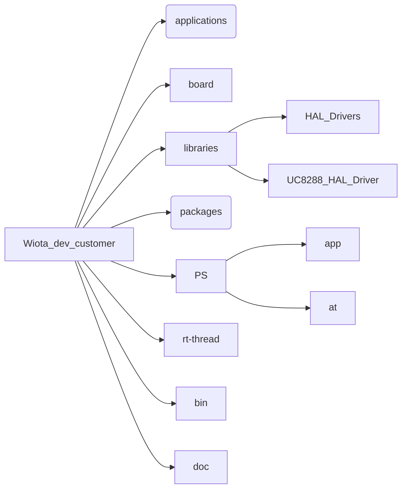
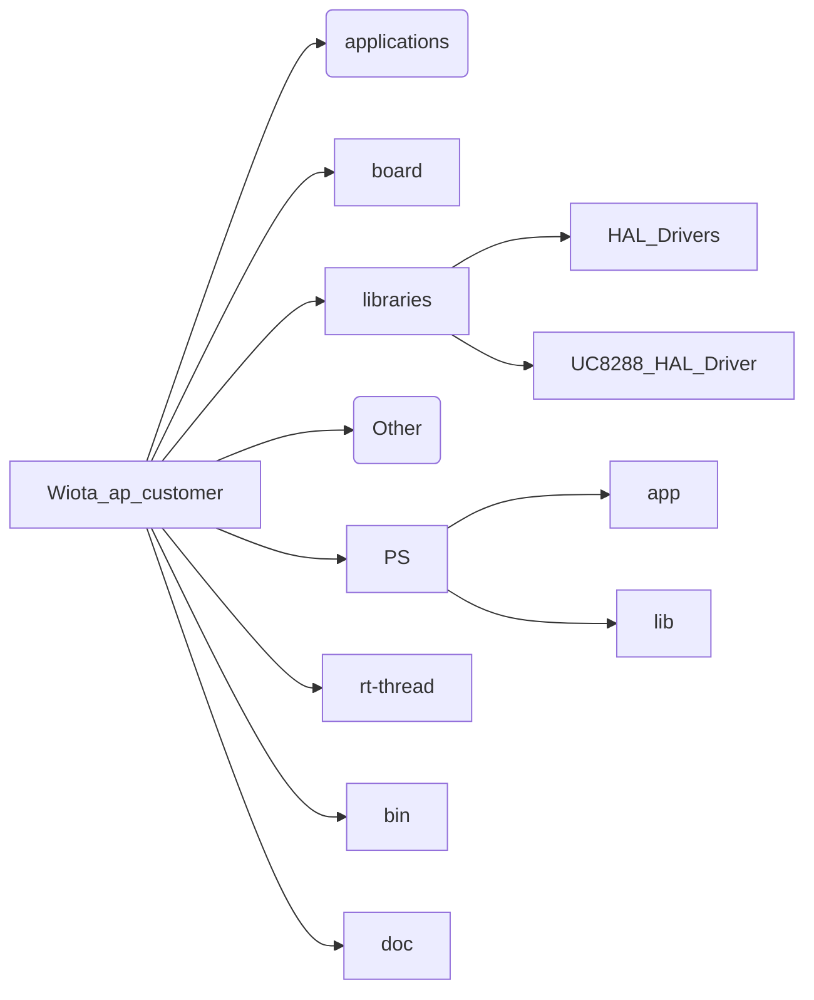

# 概述

本文介绍UC8288系列的软件架构及使用方式，以帮助客户快速进行二次开发

# 工程描述

### 1、获取方式

​		**基站侧代码**：https://github.com/ucchip/wiota_ap_customer

​		**终端侧代码**：https://github.com/ucchip/wiota_dev_customer

  ### 2、目录结构

#### 			终端侧

 * applications

   应用层，包括main函数入口和watchdog

 * board

   板级支持包

 * libraries

   驱动层，包括串口、I2C、SPI等等

 * packages

   软件包信息

 * PS

   * app：二次开发提供的接口文件，还包括一个test文件作为使用示例
   * at： Wiota的AT指令

 * rt-thread

   此目录是rt-thread系统文件，包括调度器、时钟、内存管理等等
   
* bin

  镜像文件

* doc
  IOTE配套文档

#### 		基站侧

 * applications

   应用层，包括main函数入口

 * board

   板级支持包

 * libraries

   驱动层，包括串口、I2C、SPI等等

 * Other

   包含软件包信息

 * PS

   * app：二次开发提供的接口文件，还包括一个test文件作为使用示例
   * lib： 二次开发接口的库文件

 * rt-thread

   此目录是rt-thread系统文件，包括调度器、时钟、内存管理等等
   
* bin

  刷机镜像

* doc
  AP配套文档

### 3、使用方式

 * **打开工程**

   使用codelite软件打开后缀是workspace的文件，终端侧是uc8288_rt-thread.workspace，基站侧是uc8088_wiota_ap.workspace。codelite的安装及使用方式可上网查询。

   打开工程之后可看到如下两个项目

​	                                                                                  

​	linux开头的用于在Linux系统下编译，wind开头的在Windows系统下编译。加粗的是当前激活的项目，只会编译到加粗的项目。双击项目名即可加粗。

* **编译工程**

  先配置编译工具

  * 点击工具栏Setting中的Build Settings
  
    
  
    
  
  * 点击+号，然后选择编译工具所在目录
  
    
  
    
  
    然后给这个工具取个名字，可以随便取
  
  ​                                                                                 
  
  
  
  * 得到如图所示工具
  
    
  
    点击apply，ok
  
    
  
  * 右击工程名，Compiler选择刚才配置的编译工具名
  
    
  
  
  
  * 配置完成，开始编译
  
    直接按F7快捷键编译，或者鼠标右击项目名，再点击Build编译。
  
    Linux环境下，编译成功后，在主目录下，名为flat.bin的bin文件
  
    Windows环境下，编译成功后，在bin目录下，名为wind_uc8088_ap_rt-thread.bin或wind_uc8288_dev_rt-thread.bin的文件

